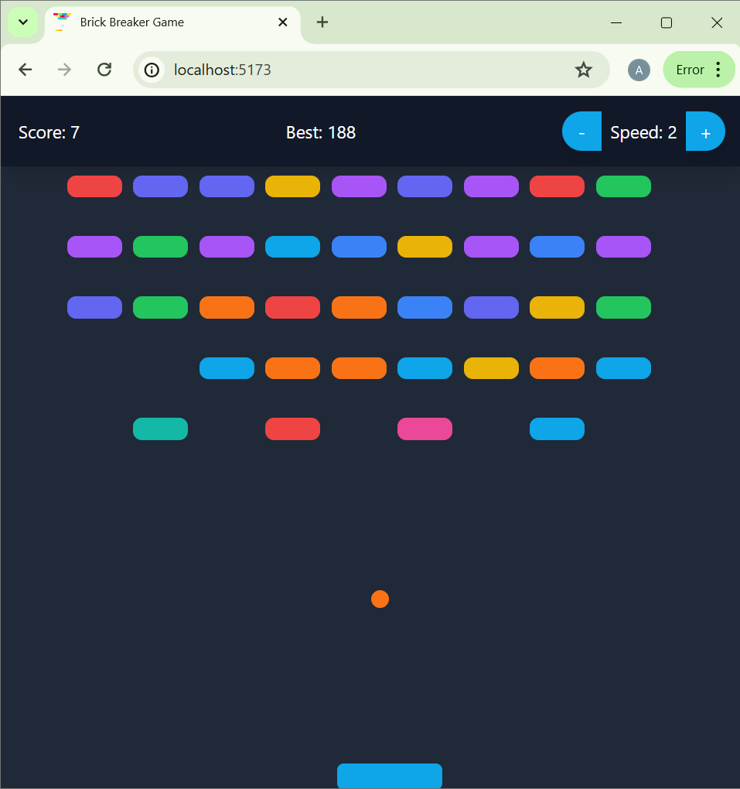
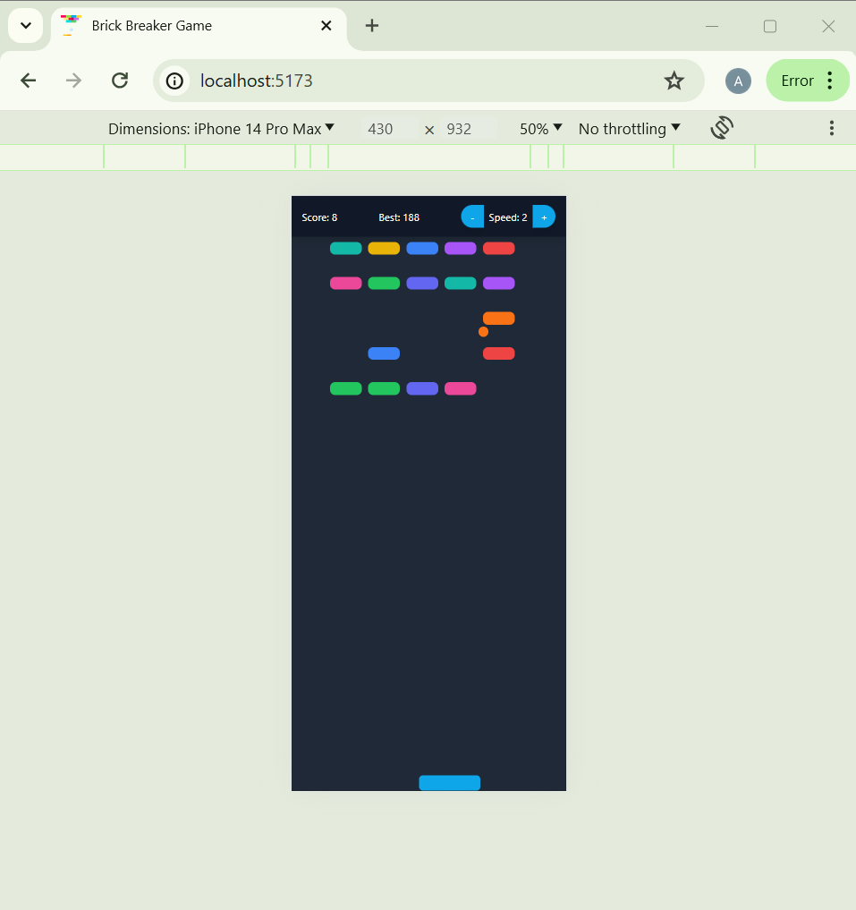

# Brick Breaker Game

This is a simple Brick Breaker game built with React and Tailwind CSS. The game features a paddle that the player can move horizontally to keep the ball from falling out of the bottom of the screen. The goal is to break all the bricks on the screen with the ball.

## Screenshots





## Video

[Video](https://github.com/abolfazlbzgh/game-2048/raw/main/video.mp4)

## Features

- **Paddle Control**: Move the paddle left and right using swipe gestures or mouse movement.
- **Brick Collision**: Break bricks by hitting them with the ball.
- **Score Tracking**: Keep track of the current score and best score using local storage.
- **Speed Control**: Increase or decrease the speed of the ball with buttons.
- **Game Over Modal**: Display a modal when the ball falls out of the screen.
- **Win Modal**: Display a modal when all bricks are cleared.
- **Responsive Design**: The game is responsive and works on both desktop and mobile devices.
- **Multiple Brick Colors**: Bricks have 10 different colors from Tailwind CSS.

## How It Works

### Components

#### Game.js

This is the main component that manages the game state and logic. It includes several hooks and utility functions to control the game flow.

- **State Management**:
  - `bricks`: An array of brick objects.
  - `ballPosition`: The current position of the ball.
  - `ballDirection`: The current direction of the ball.
  - `paddlePosition`: The current position of the paddle.
  - `gameOver`: A boolean indicating if the game is over.
  - `win`: A boolean indicating if the player has won.
  - `score`: The current score.
  - `bestScore`: The best score stored in local storage.
  - `ballSpeed`: The current speed of the ball.

- **Effects**:
  - Initializes the bricks array.
  - Updates the ball position and checks for collisions with walls, paddle, and bricks.
  - Handles game over and win conditions.
  - Updates the best score in local storage.

- **Functions**:
  - `updateBallPosition`: Updates the ball's position and checks for collisions.
  - `resetGame`: Resets the game state.
  - `increaseSpeed` & `decreaseSpeed`: Adjust the speed of the ball.

#### Paddle.js
This component renders the paddle and handles its movement based on swipe gestures or mouse movement.

#### Ball.js
This component renders the ball.

#### Brick.js
This component renders a brick with a specific position and color.

#### Modal.js
This component renders a modal that appears when the game is over or when the player wins.


## Getting Started

1. Clone the repository:

```bash
git clone https://github.com/abolfazlbzgh/brick-breaker-game.git
cd brick-breaker-game
```

2. Install dependencies:
```bash
npm install
```
3. Run the development server:
```bash
npm run dev
```
4. Open the browser:
Open http://localhost:5173 to view the game in the browser.

## Conclusion
This project demonstrates a simple yet complete implementation of a classic Brick Breaker game using modern web technologies. The game includes features such as real-time paddle movement, collision detection, score tracking, speed control, and responsive design. It provides a good foundation for further enhancements and customization.

## License
This project is licensed under the MIT License. See the [LICENSE](./LICENSE.txt) file for details.